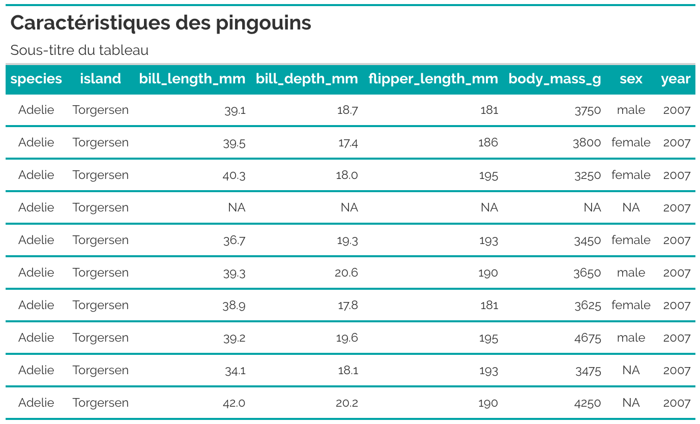
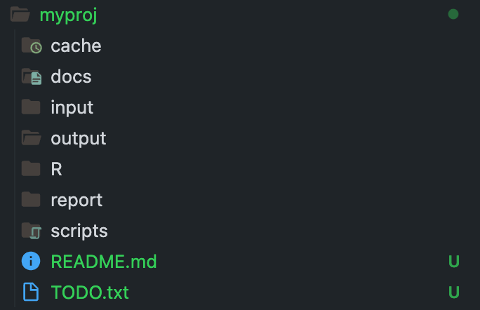

<!-- README.md is generated from README.Rmd. Please edit that file -->

```{r, include = FALSE}
knitr::opts_chunk$set(
  collapse = TRUE,
  comment = "#>",
  fig.path = "man/figures/README-",
  out.width = "100%",
  dpi = 320
)
```

# InraeThemes 

<!-- badges: start -->

[](https://lifecycle.r-lib.org/articles/stages.html#experimental)

[](https://www.gnu.org/licenses/gpl-3.0.en.html)
[](https://github.com/davidcarayon/InraeThemes/actions/workflows/R-CMD-check.yaml)
[](https://zenodo.org/badge/latestdoi/274901390)

<!-- badges: end -->

> _InraeThemes is a collection of R templates, themes, and other graphical elements based on formats related to R and in accordance with the INRAE design system._

The goal of this :package: is to provide a easy to use themes and color palettes for INRAE engineers and researchers. These are an __unofficial__ and __opiniated__ templates.

## Related work

- The [quarto-inrae-extension](https://github.com/davidcarayon/quarto-inrae-extension) which provides a wide range of quarto-based formats for documents, slides and projects.

## Prerequisites

To make the full use of this package, you will need the `Raleway` font that can be downloaded [here](https://fonts.google.com/specimen/Raleway)

## Installation

The package can be installed using:

``` r
# install.packages("remotes")
remotes::install_github("davidcarayon/InraeThemes")
```

> Note: Older versions with Rmarkdown templates (i.e., 1.0.1) can still be downloaded using:
> 
> ``` r
> # install.packages("remotes")
> remotes::install_github("davidcarayon/InraeThemes@v1.0.1")
> ```

### ggplot2 themes and scales

Customize your ggplots using INRAE's colors with `theme_inrae()` and/or `scale_<fill/color>_inrae()`.

Here are examples using the palmerpenguins dataset.

```{r example, message = FALSE, fig.showtext=TRUE, fig_retina = 1, warning = FALSE, fig.width = 10}
library(InraeThemes)
library(ggplot2)
library(palmerpenguins)

# If needed
# sysfonts::font_add_google("Raleway")

# Load the fonts
showtext::showtext_auto()

ggplot(penguins, aes(x = flipper_length_mm, y = body_mass_g, color = species)) +
  geom_point(size = 3, alpha = 0.7) +
  labs(
    title = "Relation entre la longueur des nageoires et la masse corporelle",
    subtitle = "Données des pingouins par espèce",
    x = "Longueur des nageoires (mm)",
    y = "Masse corporelle (g)"
  ) +
  theme_inrae() +
  scale_color_inrae()

ggplot(penguins, aes(x = species, y = body_mass_g, fill = species)) +
  geom_boxplot(alpha = 0.7) +
  labs(
    title = "Masse corporelle des différentes espèces de pingouins",
    x = "Espèce",
    y = "Masse corporelle (g)"
  ) +
  theme_inrae() +
  scale_fill_inrae()

ggplot(penguins, aes(x = bill_length_mm, fill = species)) +
  geom_histogram(binwidth = 2, position = "stack", color = "white") +
  labs(
    title = "Distribution de la longueur du bec des pingouins",
    x = "Longueur du bec (mm)",
    y = "Fréquence"
  ) +
  theme_inrae() +
  scale_fill_inrae()

ggplot(penguins, aes(x = flipper_length_mm, fill = species)) +
  geom_density(alpha = 0.6) +
  labs(
    title = "Distribution de la longueur des nageoires par espèce",
    x = "Longueur des nageoires (mm)",
    y = "Densité"
  ) +
  theme_inrae() +
  scale_fill_inrae()

ggplot(penguins, aes(x = flipper_length_mm, y = body_mass_g, color = island)) +
  geom_point(size = 3, alpha = 0.7) +
  labs(
    title = "Dimensions des nageoires et masse corporelle par espèce et île",
    x = "Longueur des nageoires (mm)",
    y = "Masse corporelle (g)"
  ) +
  theme_inrae() +
  scale_color_inrae() +
  facet_wrap(~species)
```

### gt theme

This package also provides a {gt} theme with `theme_inrae_gt()`:


```{r example gt, message = FALSE, warning = FALSE, eval = FALSE}
library(gt)
tab <- penguins |>
  head(10) |>
  gt() |>
  tab_header(
    title = md("**Caractéristiques des pingouins**"),
    subtitle = "Sous-titre du tableau"
  ) |>
  theme_inrae_gt() 
```




### Bootstrap theme

This package also provides a Sass theme built with [{bslib}]([https://](https://rstudio.github.io/bslib/)): bs_inrae(). Preview the theme with:

```r
bslib::bs_theme_preview(bs_inrae())
```


And can be used in any Shiny app with :

```r
ui <- fluidPage(
  theme = InraeThemes::bs_inrae(),
  ...
)
```

## Project templates

This package provides an opinionated project directory structure for data analysis which can be either used by going though `Projects > New Project > New Directory` in Rstudio or by using :

```r 
new_analysis("myproj")
```

