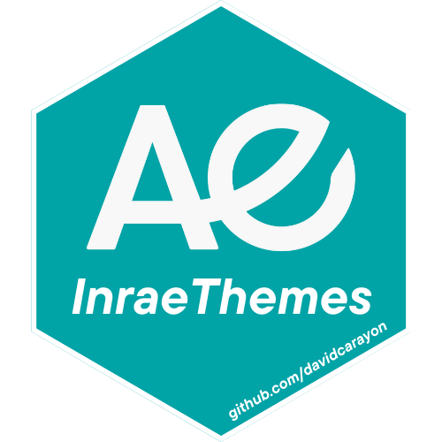

<!-- README.md is generated from README.Rmd. Please edit that file -->

```{r, include = FALSE}
knitr::opts_chunk$set(
  collapse = TRUE,
  comment = "#>",
  fig.path = "man/figures/README-",
  out.width = "100%",
  dpi = 320
)
library(magrittr)
```

# InraeThemes 

<!-- badges: start -->
[](https://www.tidyverse.org/lifecycle/#experimental)
<!-- badges: end -->

InraeThemes est un package proposant une variété de templates (Rmarkdown), de thèmes (ggplot) et de fonctions utilitaires qui respectent la charte graphique INRAE.

**Attention : Ces modèles nécessitent l'installation de 2 polices adoptées dans la charte graphique INRAE : [Raleway](https://fonts.google.com/specimen/Raleway) et [Avenir Next Pro](https://fr.maisfontes.com/avenir-next-lt-pro).**

# Installation

Le package peut-être installé via :

``` r
# install.packages("remotes")
remotes::install_github("davidcarayon/InraeThemes")
```

Si vous ne possédez aucune installation de LaTeX sur votre machine, vous devrez également en installer une version minimale pour utiliser les modèles mobilisant LaTeX :

``` r
install.packages("tinytex")
tinytex::install_tinytex()
```

# Thème ggplot2

Ce package propose différentes fonctions permettant de personnaliser les graphiques produits avec {ggplot2} pour qu'ils correspondent à la charte graphique INRAE.

## Palette de couleurs

La palette de couleurs construite à partir de la charte graphique V3 est la suivante :

```{r}
library(InraeThemes)
scales::show_col(palette_inrae())
```

## Utilisation du thème et des échelles de couleur

Ce package propose les 3 fonctions suivantes :

```{r eval =FALSE}
theme_inrae()
scale_color_inrae()
scale_fill_inrae()
```

Voici différents exemples d'utilisation de ces fonctions :

```{r example, message = FALSE, fig.width = 14, fig.height=8, dpi = 320}
library(ggplot2)

## On charge les données d'exemple du package
data("example_datasets")

## On construit 4 graphiques d'exemple, stockés dans une même liste
display <- list(
  ggplot(example_datasets$www, aes_string(x = 'Minute', y = 'Users',
                                          color = 'Measure',
                                          shape = 'Measure')) + 
    geom_line() + 
    geom_point(size = 3) + 
    facet_wrap(~Measure) +
    geom_point(size = 1.8) +
    scale_color_inrae() +
    scale_shape_manual(values = c(15, 16)) +
    labs(title = "Titre", subtitle = "Sous-titre") +
    theme_inrae(),
  
  ggplot(example_datasets$cars, aes_string(x = 'mpg', fill = 'cyl',
                                           colour = 'cyl')) + 
    geom_density(alpha = 0.75) + 
    scale_fill_inrae() +
    scale_color_inrae() +
    labs(fill = 'Cylinders', colour = 'Cylinders', x = 'MPG', y = 'Density') +
    theme_inrae(),
  
  ggplot(example_datasets$dia, aes_string(x = 'price', fill = 'cut')) + 
    geom_histogram(binwidth = 850) + 
    xlab('Price (USD)') + 
    ylab('Count') + 
    scale_fill_inrae() +
    scale_x_continuous(label = function(x) paste0(x / 1000, 'k'))+
    theme_inrae(),
  
  ggplot(example_datasets$drivers, aes_string(x = 'Year', y = 'Deaths',
                                              fill = "Year")) + 
    geom_boxplot(size = 0.25) + 
    ylab('Monthly Deaths') +
    theme_inrae() +
    scale_fill_inrae() +
    coord_flip() +
    labs(caption = "Caption") 
)

# On assemble
do.call(gridExtra::grid.arrange,  display)
```

# Création d'un répertoire d'analyse

Ce package propose également un modèle d'architecture conseillé pour une analyse de données. La structure choisie correspond aux bonnes pratiques définies par les auteurs de ce package, mais ne constitue en aucun cas une référence et chaque utilisateur est libre d'adapter la structure proposée à ses propres préférences.

La création de ce répertoire d'analyse s'opérer via la ligne de commande suivante :

```{r eval = FALSE}
new_analysis(dir = "MyProject")
```

Ce qui va produire l'output suivant :

```
! Working directory changed to '~/Bureau/MyProject'
✓ A new analysis directory was created with the following directories :
├── MyProject
│   ├── data # Contient les données
│   ├── R # Contient les scripts basiques (.R) ou les notebooks (.Rmd)
│   │   └── 01_notebook.Rmd
│   ├── plots # Contient les graphiques produits
│   ├── raw-data # Contient des jeux de données à exclure du suivi de version 
│   ├── README.md # Pour décrire le projet
ℹ Now opening 'R/01_notebook.Rmd'
```
Puis, le répertoire de travail sera automatiquement déplacé vers ce répertoire et le fichier `R/01_notebook.Rmd` sera automatiquement ouvert afin de débuter les analyses. Ce notebook contient lui-même un certain nombre de conseils proposés par les auteurs de ce package.

# Templates de documents/présentations

Ce package permet enfin de rédiger des rapports et/ou présentations pré-formatés selon la charte graphique INRAE via un plugin RStudio. Les modèles sont accessibles via `File > New File > Rmarkdown > From Template`.

**Attention, ces fonctions ne visent qu'à fournir des templates (css, LaTeX, docx, logos) correspondants à la charte INRAE, associés à des fichiers Rmarkdown avec un YAML correctement configuré. Nous invitons les utilisateurs à se renseigner par la suite sur chacune des technologies utilisées (rmarkdown, LaTeX, pagedown, officedown, revaljs, remarkjs, etc.) pour aller plus loin dans la personnalisation des documents.**

##  Rapport (court) INRAE Pagedown

Ce premier template permet de produire un rapport HTML et/ou PDF (au choix) en utilisant le package {pagedown}. Ce format est dédié à la rédaction de rapports relativement courts car la rédaction se concentre dans un seul fichier .Rmd. Lorsque la rédaction devient plus lourde avec séparation des chapitres et une bibliographie par chapitre par exemple, il convient de passer au modèle suivant (i.e. {bookdown}).

{pagedown} est un package s'appuyant sur [rmarkdown](https://rmarkdown.rstudio.com/) et [pagedjs](https://www.pagedjs.org/) afin de produire des documents HTML dits "paginés". Puisqu'il s'agit de documents HTML, l'affichage est entièrement personnalisable via l'utilisation de code HTML/CSS. Pour plus d'informations : [Visitez le site de {pagedown}](https://pagedown.rbind.io/).

Le template .Rmd est livré avec une feuille de style .css correspondant aux couleurs INRAE ainsi que différents éléments graphiques (logo, première/dernière page, etc.). Un template au format .svg est également livré afin d'éditer les premières/dernières pages, par exemple pour modifier l'image de fond ou pour écrire directement les informations du rapport (dans le cas par exemple d'un titre trop long, d'un sous-titre, etc.). 

L'utilisateur pourra choisir d'utiliser `chrome_print` dans le YAML au moment de la compilation pour obtenir un fichier PDF en plus de la sortie HTML. 

Voici un exemple de rapport :


## Rapport (long) INRAE

Ce second template permet de produire un rapport HTML et/ou PDF (au choix) en utilisant le package {bookdown}. Ce format est dédié à la rédaction document longs et complexes (i.e livres, thèses, etc.) car il permet une gestion modulaire des chapitres, notamment en ce qui concerne la bibliographie.

{bookdown} est un package principalement dédié, tel que son nom l'indique, à la rédaction de livres. Contrairement au format {pagedown}, la version PDF nécessitera ici une installation LaTeX. Pour plus d'informations : [Visitez le site de {bookdown}](https://bookdown.org/).

Comme il s'agit d'un format particulier, constitué d'un grand nombre de fichiers, celui-ci ne peut être proposé comme template Rstudio. Mais son utilisation reste simple, puisqu'il suffit juste de lancer la commande :

```{r eval = FALSE}
bookdown_inrae("Mon_Rapport")
```

Pour que le dossier avec l'ensemble des fichiers soit créé à l'endroit de votre choix. Le répertoire de travail est automatiquement modifié et le fichier "index.Rmd" automatiquement ouvert.

Voici un exemple de rapport :


## Présentation INRAE RevealJS

Ce troisième template permet de produire une présentation HTML utilisant la technologie RevealJS (présentation web en 2 dimensions).

Le template Rmd est livré avec une feuille de style CSS correspondant aux couleurs INRAE ainsi que différents graphismes (logo, première page, etc.)

L'utilisateur pourra choisir d'utiliser `chrome_print` au moment de la compilation pour obtenir un fichier PDF en plus de la sortie HTML.


## Présentation INRAE RemarkJS

Cette seconde fonction permet de produire une présentation HTML utilisant la technologie RemarkJS.

Le template Rmd est livré avec une feuille de style CSS correspondant aux couleurs INRAE ainsi que différents graphismes (logo, première page, etc.)

L'utilisateur pourra choisir d'utiliser `chrome_print` au moment de la compilation pour obtenir un fichier PDF en plus de la sortie HTML.


## TO-DO

- Rapport Word
