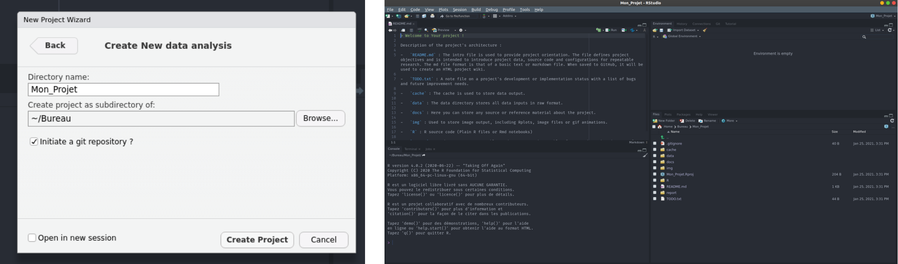
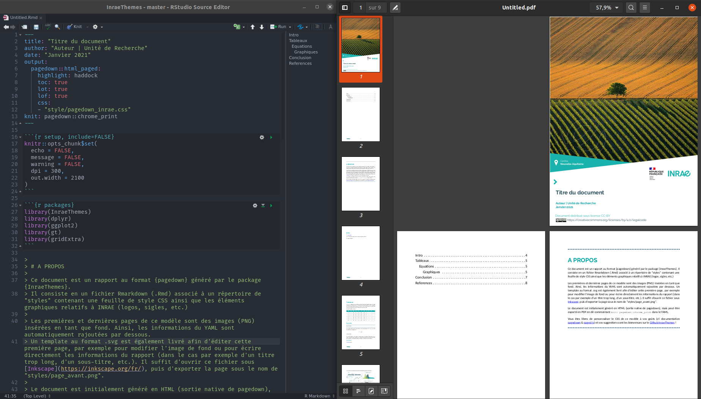
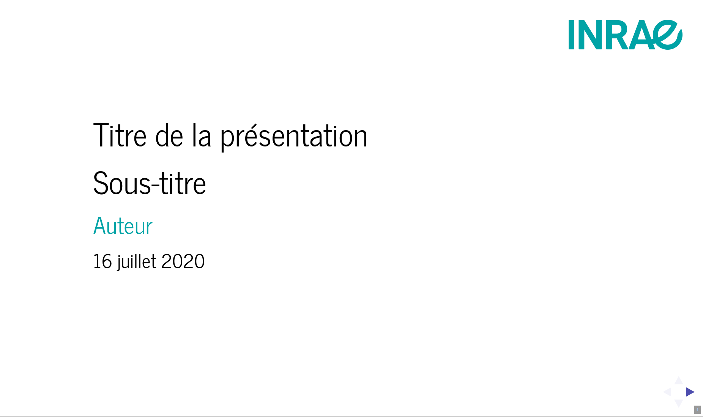
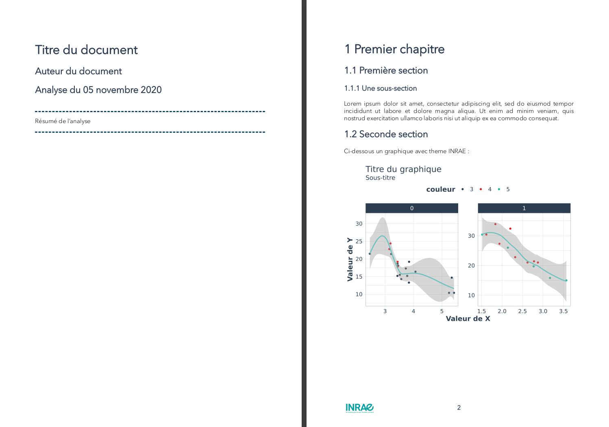
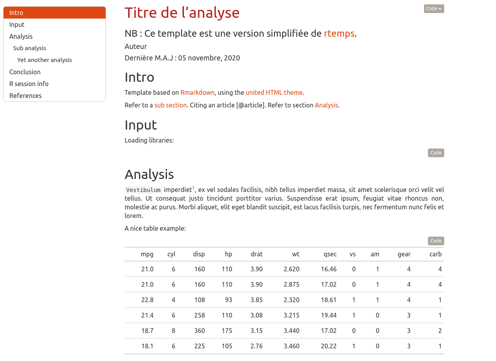

<!-- README.md is generated from README.Rmd. Please edit that file -->

# InraeThemes 

<!-- badges: start -->

[](https://www.tidyverse.org/lifecycle/#experimental)
<!-- badges: end -->

InraeThemes est un package proposant une variété de templates
(Rmarkdown) de thèmes (ggplot) et de fonctions utilitaires qui
respectent la charte graphique INRAE.

**Attention : Ces modèles nécessitent l’installation de 2 polices
adoptées dans la charte graphique INRAE : “Raleway” et “Avenir Next
Pro”.**

## Installation

Le package peut-être installé via :

``` r
# install.packages("devtools")
devtools::install_github("davidcarayon/InraeThemes")
```

## Exemple

Voici un exemple de graphique utilisant un thème proposé dans le
package, `theme_quant()`, inspiré du package `{tidyquant}`.

``` r
library(InraeThemes)
library(ggplot2)

ggplot(mtcars, aes(x=wt, y=mpg)) +
  geom_point(aes(color = as.factor(gear)))+
  scale_color_quant()+
  geom_smooth(color = couleurs_inrae[1]) +
  labs(x = "Valeur de X", y = "Valeur de Y", title = "Titre du graphique", subtitle = "Sous-titre", color = "couleur") +
  theme_quant()
```


# Création d’un répertoire d’analyse

La fonction utilitaire `create_analysis_dir()` permet de créer, dans le
répertoire de votre choix, une architecture “classique” d’un projet
d’analyse de données :

``` r
create_analyse_dir(dir = getwd())
```



# Utilisation de modèles

Ce package permet de rédiger des rapports pré-formatés au style INRAE.
Les modèles sont directement accessibles dans Rstudio via `File > New
File > Rmarkdown > From Template`.

## Rapport INRAE

Rapport PDF ou HTML utilisant {pagedown}



## Présentation dynamique INRAE

Présentation HTML et/ou PDF utilisant {revealjs} et
`pagedown::chrome_print()`



## Rapport simplifié INRAE

Rapport avec moins de formattage que le rapport précédent, dédié aux
documents de travail pour partager des résultats d’analyse.



## Rapports reproductibles

Rapports mettant encore plus l’accent sur la reproductibilité des
analyses.


