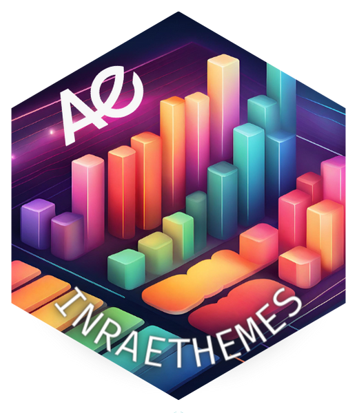
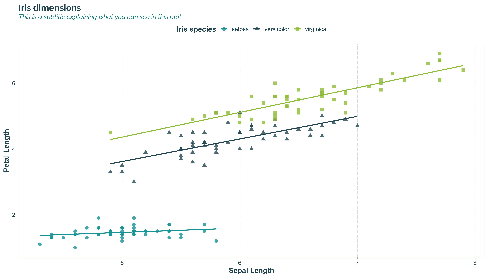
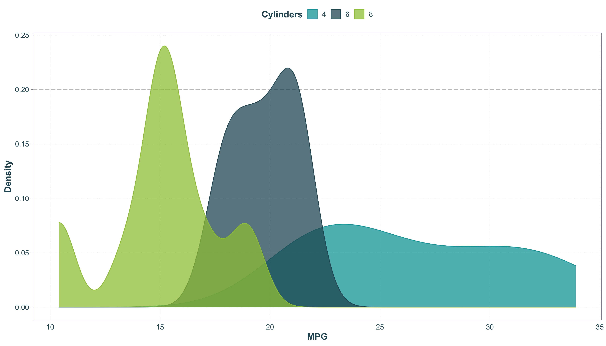
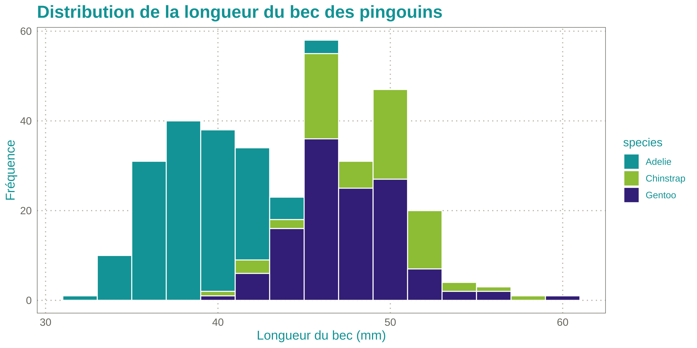
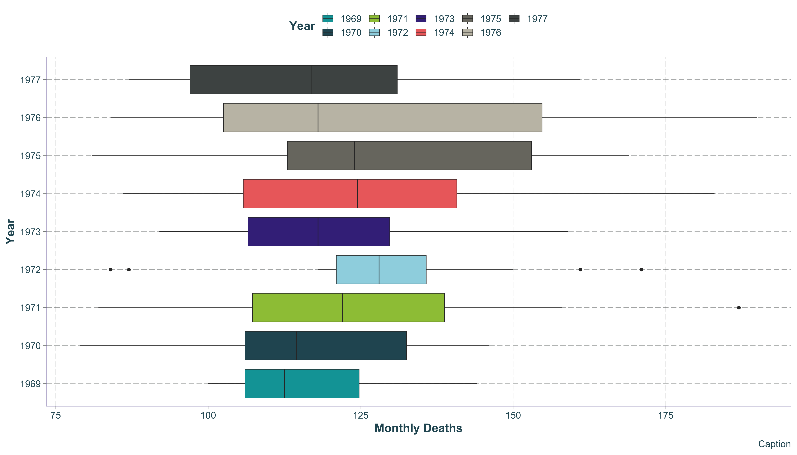
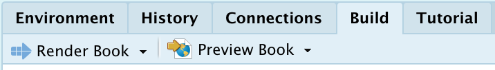

<!-- README.md is generated from README.Rmd. Please edit that file -->

# InraeThemes 

<!-- badges: start -->

[](https://www.tidyverse.org/lifecycle/#experimental)
[](commits/master)
[](https://www.gnu.org/licenses/gpl-3.0.en.html)
[](https://github.com/davidcarayon/InraeThemes/actions/workflows/R-CMD-check.yaml)
[](https://zenodo.org/badge/latestdoi/274901390)

<!-- badges: end -->

> *InraeThemes est une collection non officielle de templates, thèmes et
> autres éléments graphiques basés sur des formats en lien avec R et en
> accords avec la charte graphique INRAE.*

# Installation

Le package peut-être installé via :

``` r
# install.packages("remotes")
remotes::install_github("davidcarayon/InraeThemes")
```

ou encore via :

``` r
# install.packages("remotes")
remotes::install_git("https://gitlab.irstea.fr/david.carayon/inraethemes")
```

> NB : L’ancienne version (1.0.1), qui contenait notamment des modèles
> Rmarkdown, peut toujours être installée via :

``` r
# install.packages("remotes")
remotes::install_github("davidcarayon/InraeThemes@v1.0.1")
```

# Pré-requis

- Certaines fonctionnalités de ce package nécessitent l’installation de
  2 polices adoptées dans la charte graphique INRAE : *Raleway* et
  *Avenir Next LT Pro*. Ces polices peuvent être téléchargées
  [ici](https://intranet.inrae.fr/charte-identitaire/content/download/3007/30036/version/5/file/POLICES.zip).

- La police Fira Code est utilisée dans certains templates et est,
  d’ailleurs, recommandée sur votre Rstudio pour l’affichage du code
  avec ligatures : [Fira
  Code](https://fonts.google.com/specimen/Fira+Code)

- Si vous ne possédez aucune installation de LaTeX sur votre machine,
  vous devrez également en installer une version minimale pour utiliser
  les modèles mobilisant LaTeX :

``` r
install.packages("tinytex")
tinytex::install_tinytex()
```

- Certains modèles nécessitent l’utilisation de Quarto, successeur de
  Rmarkdown, qui peut être téléchargé ici :
  <https://quarto.org/docs/get-started/>.

- Une version de Rstudio supérieure à la 2022.02.1 est nécessaire pour
  utiliser Quarto de manière conviviale.

# Thème et palettes {ggplot2}

La palette de couleurs est construite à partir de la charte graphique
V3.

``` r
palette_inrae()
```


Les deux fonctions à utiliser sont `theme_inrae()` pour le thème général
du graphique ainsi que les fonctions `scale_<fill/color>_inrae()`.

``` r
library(InraeThemes)
library(ggplot2)

## Example dataset
data("example_datasets")

ggplot(example_datasets$www, aes(x = Minute, y = Users, color = Measure, shape = Measure)) +
  geom_line() +
  geom_point(size = 3) +
  facet_wrap(~Measure) +
  geom_point(size = 1.8) +
  scale_color_inrae() +
  scale_shape_manual(values = c(15, 16)) +
  labs(title = "Titre", subtitle = "Sous-titre") +
  theme_inrae()
```



``` r

ggplot(example_datasets$cars, aes(x = mpg, fill = cyl,colour = cyl)) +
  geom_density(alpha = 0.75) +
  scale_fill_inrae() +
  scale_color_inrae() +
  labs(fill = "Cylinders", colour = "Cylinders", x = "MPG", y = "Density") +
  theme_inrae()
```



``` r

ggplot(example_datasets$dia, aes(x = price, fill = cut)) +
  geom_histogram(binwidth = 850) +
  xlab("Price (USD)") +
  ylab("Count") +
  scale_fill_inrae() +
  scale_x_continuous(label = function(x) paste0(x / 1000, "k")) +
  theme_inrae()
```



``` r

ggplot(example_datasets$drivers, aes(x = Year, y = Deaths,fill = Year)) +
  geom_boxplot(size = 0.25) +
  ylab("Monthly Deaths") +
  theme_inrae() +
  scale_fill_inrae() +
  coord_flip() +
  labs(caption = "Caption")
```



# Thème Shiny/Sass

Ce package propose un thème Sass construit avec
[bslib](https://rstudio.github.io/bslib/). Le thème peut être
prévisualisé comme ceci :

``` r
bslib::bs_theme_preview(bs_inrae())
```


Et est utilisé dans une application Shiny via :

``` r
ui <- fluidPage(
  theme = InraeThemes::bs_inrae(),
  ...
)
```

# Templates de documents aux couleurs INRAE

Il existe à ce jour dans l’écosystème R deux technologies (ou packages)
pour la réalisation de documents :

- [Rmarkdown](https://rmarkdown.rstudio.com/) : Le plus classique,
  bénéficie aujourd’hui d’un bon recul et d’une bonne stabilité
- [Quarto](https://quarto.org/) : Une nouvelle version de Rmarkdown,
  plus orientée “multilangue” et moins dépendant de R. Mais très jeune
  et soumis à de nombreuses évolutions.

Pour le package {InraeThemes}, la décision a été prise très tôt de
migrer au plus vite les sorties proposées vers Quarto dès qu’un
équivalent à ce qui était proposé avec Rmarkdown est disponible.

> **Dans les deux cas, ce package ne vise qu’à fournir des templates
> associés à des ressources (Tex, Css…) et à des documents Rmd/Qmd au
> YAML correctement configurés. Il est recommandé de se tourner vers les
> documentations de ces deux technologies pour pleinement profiter des
> fonctionnalités proposées.**

Vous trouverez les documentations respectives à ces liens :

- [Documentation Quarto](https://quarto.org/docs/guide/)

- [Documentation Rmarkdown](https://bookdown.org/yihui/rmarkdown/)

## Templates Rmarkdown

Trois templates Rmarkdown sont encore proposés par ce package et sont
accessibles via l’interface graphique Rstudio :

| Format (Technologie)             | Via Interface graphique Rstudio                                 |
|----------------------------------|-----------------------------------------------------------------|
| Présentation Xaringan (RemarkJS) | New file \> Rmarkdown \> From Template \> Présentation INRAE    |
| Rapport Paginé (PagedJS)         | New file \> Rmarkdown \> From Template \> Rapport INRAE         |
| Cartes de visite (PagedJS)       | New file \> Rmarkdown \> From Template \> Carte de visite INRAE |

> **Note : Avec la récente implémentation de PagedJS dans Quarto, les
> deux derniers formats seront bientôt amenés à migrer vers Quarto**

## Templates Quarto

Rstudio ne propose pas actuellement de module de création de document
Quarto avec template via leur interface graphique. La procédure
actuellement proposée pour l’utilisation de templates Quarto est de
créer des [extensions](https://quarto.org/docs/extensions/formats.html)
Quarto.

L’extension créee pour accompagner {InraeThemes} est ici :
[davidcarayon/quarto-inrae-extension](https://github.com/davidcarayon/quarto-inrae-extension)

### Installation de l’extension

Pour l’installer, l’utilisation du terminal est pour l’instant requise
(en attendant l’acceptation de la
[PR#45](https://github.com/quarto-dev/quarto-r/pull/45)). Deux approches
sont possibles.

Pour démarrer un nouveau document/projet avec l’extension :

``` bash
quarto use template davidcarayon/quarto-inrae-extension
```

Pour ajouter l’extension sur un projet déjà existant :

``` bash
quarto install extension davidcarayon/quarto-inrae-extension
```

### Utilisation

Un template au format .Qmd sera automatiquement créé en portant le nom
saisi dans le terminal. Le choix du format de sortie désiré se fait dans
le YAML en rajoutant le format en suffixe à `inrae-*`. Les formats
possibles sont :

Pour des slides :

- `inrae-revealjs` (HTML)
- `inrae-pptx` (Powerpoint)
- `inrae-beamer` (PDF)

Pour des documents :

- `inrae-html` (HTML)
- `inrae-docx` (Word)
- `inrae-pdf` (PDF)

### Personnalisation

Pour customiser ces templates, il vous suffit de vous rendre dans le
répertoire `_extensions` et de modifier les fichiers css/scss/tex ou les
images associées.

**A noter pour les rapports PDF :**

- La sortie PDF (basée sur LaTeX) s’appuie sur des fichiers `.tex`
  indépendants qu’il faudra customiser à l’intérieur de l’extension pour
  l’image de couverture ainsi que pour la dernière page.

- L’image sur la page de garde (photo.png) peut-être remplacée par
  n’importe quelle image. Si la hauteur de la nouvelle image diffère de
  celle d’origine, il faudra alors modifier la valeur en cm du
  `\vspace*{}` en L11 de `templates/page_de_garde.tex` pour retrouver
  une mise en forme correcte.

- La cartouche “Centre” peut être remplacée par celle qui vous
  correspond à télécharger
  [ici](https://intranet.inrae.fr/charte-identitaire/content/download/3749/33311/version/1/file/Cartouches%20Centre.zip)

# Template de projets

## Livre quarto (ou rapport fragmenté)

Il est également possible via ce package, via l’interface de création de
projet Rstudio, de créer un projet de livre quarto (équivalent à un
rapport avec plusieurs chapitres) à la
[{bookdown}](https://bookdown.org/) :

- `Projects > New Project > New Directory > Livre / Rapport chapitré INRAE`

Il suffit d’utiliser le bouton `Build` (situé en haut à droite sur
Rstudio) pour compiler ce type de document une fois créé.



## Analyse de données

Nous proposons dans ce package un template de projet pour l’analyse de
données, librement inspiré du package
[{ProjectTemplate}](https://cran.r-project.org/web/packages/ProjectTemplate/)
Ce template est directement accessible dans Rstudio via
`Projects > New Project > New Directory > Data Analysis Project`.
L’utilisateur peut ici définir la localisation de son projet et choisir
d’initialiser ou non un dépôt git.

> Note : Cette architecture n’est qu’un exemple de bonne pratiques
> parmis bien d’autres. Libre à l’utilisateur de modifier ce template
> selon ses habitudes. Vos suggestions d’améliorations sont évidemment
> les bienvenues
> [ici](https://github.com/davidcarayon/InraeThemes/issues).

# Work in Progress / TO-DO

- Meilleure gestion de la page de garde PDF (photo) ainsi que des infos
  de bas de page directement dans le YAML
- Implémentation des templates issus de PagedJS lorsqu’il seront
  disponibles
- Proposition de code R au lieu du terminal pour l’installation
  d’extension quarto (en attente PR#45)
