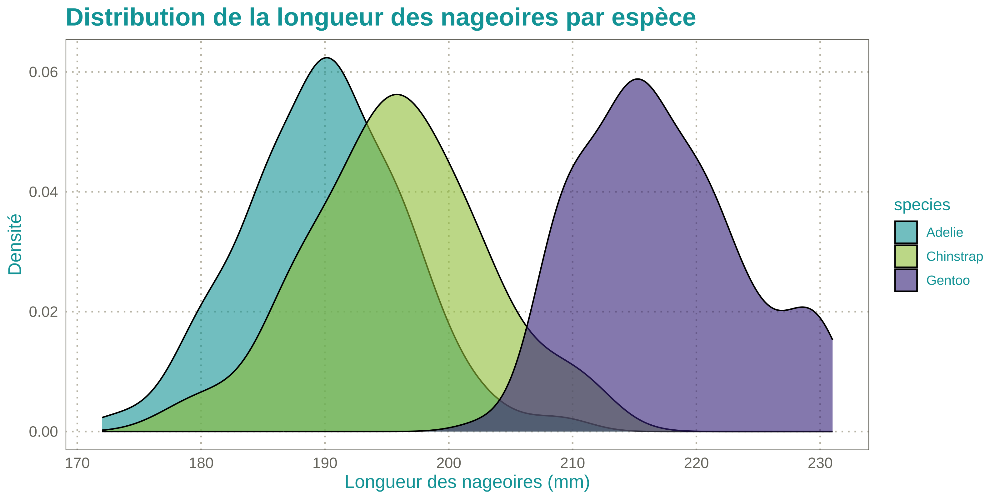

<!-- README.md is generated from README.Rmd. Please edit that file -->

# InraeThemes 

<!-- badges: start -->

[](https://lifecycle.r-lib.org/articles/stages.html#experimental)

[](https://www.gnu.org/licenses/gpl-3.0.en.html)
[](https://github.com/davidcarayon/InraeThemes/actions/workflows/R-CMD-check.yaml)
[](https://zenodo.org/badge/latestdoi/274901390)

<!-- badges: end -->

> *InraeThemes is a collection of R templates, themes, and other
> graphical elements based on formats related to R and in accordance
> with the INRAE design system.*

The goal of this :package: is to provide a easy to use themes and color
palettes for INRAE engineers and researchers. These are an
**unofficial** and **opiniated** templates.

## Related work

- The
  [quarto-inrae-extension](https://github.com/davidcarayon/quarto-inrae-extension)
  which provides a wide range of quarto-based formats for documents,
  slides and projects.

## Prerequisites

To make the full use of this package, you will need the `Raleway` font
that can be downloaded [here](https://fonts.google.com/specimen/Raleway)

## Installation

The package can be installed using:

``` r
# install.packages("remotes")
remotes::install_github("davidcarayon/InraeThemes")
```

> Note: Older versions with Rmarkdown templates (i.e., 1.0.1) can still
> be downloaded using:
>
> ``` r
> # install.packages("remotes")
> remotes::install_github("davidcarayon/InraeThemes@v1.0.1")
> ```

### ggplot2 themes and scales

Customize your ggplots using INRAE’s colors with `theme_inrae()` and/or
`scale_<fill/color>_inrae()`.

Here are examples using the palmerpenguins dataset.

``` r
library(InraeThemes)
library(ggplot2)
library(palmerpenguins)

# If needed
# sysfonts::font_add_google("Raleway")

# Load the fonts
showtext::showtext_auto()

ggplot(penguins, aes(x = flipper_length_mm, y = body_mass_g, color = species)) +
  geom_point(size = 3, alpha = 0.7) +
  labs(
    title = "Relation entre la longueur des nageoires et la masse corporelle",
    subtitle = "Données des pingouins par espèce",
    x = "Longueur des nageoires (mm)",
    y = "Masse corporelle (g)"
  ) +
  theme_inrae() +
  scale_color_inrae()
```


``` r

ggplot(penguins, aes(x = species, y = body_mass_g, fill = species)) +
  geom_boxplot(alpha = 0.7) +
  labs(
    title = "Masse corporelle des différentes espèces de pingouins",
    x = "Espèce",
    y = "Masse corporelle (g)"
  ) +
  theme_inrae() +
  scale_fill_inrae()
```


``` r

ggplot(penguins, aes(x = bill_length_mm, fill = species)) +
  geom_histogram(binwidth = 2, position = "stack", color = "white") +
  labs(
    title = "Distribution de la longueur du bec des pingouins",
    x = "Longueur du bec (mm)",
    y = "Fréquence"
  ) +
  theme_inrae() +
  scale_fill_inrae()
```


``` r

ggplot(penguins, aes(x = flipper_length_mm, fill = species)) +
  geom_density(alpha = 0.6) +
  labs(
    title = "Distribution de la longueur des nageoires par espèce",
    x = "Longueur des nageoires (mm)",
    y = "Densité"
  ) +
  theme_inrae() +
  scale_fill_inrae()
```



``` r

ggplot(penguins, aes(x = flipper_length_mm, y = body_mass_g, color = island)) +
  geom_point(size = 3, alpha = 0.7) +
  labs(
    title = "Dimensions des nageoires et masse corporelle par espèce et île",
    x = "Longueur des nageoires (mm)",
    y = "Masse corporelle (g)"
  ) +
  theme_inrae() +
  scale_color_inrae() +
  facet_wrap(~species)
```


### gt theme

This package also provides a {gt} theme with `theme_inrae_gt()`:

``` r
library(gt)
penguins |>
  head(10) |>
  gt() |>
  tab_header(
    title = md("**Caractéristiques des pingouins**"),
    subtitle = "Sous-titre du tableau"
  ) |>
  theme_inrae_gt()
```

<div id="ptrrprvatx" style="padding-left:0px;padding-right:0px;padding-top:10px;padding-bottom:10px;overflow-x:auto;overflow-y:auto;width:auto;height:auto;">
<style>#ptrrprvatx table {
  font-family: Raleway;
  -webkit-font-smoothing: antialiased;
  -moz-osx-font-smoothing: grayscale;
}
&#10;#ptrrprvatx thead, #ptrrprvatx tbody, #ptrrprvatx tfoot, #ptrrprvatx tr, #ptrrprvatx td, #ptrrprvatx th {
  border-style: none;
}
&#10;#ptrrprvatx p {
  margin: 0;
  padding: 0;
}
&#10;#ptrrprvatx .gt_table {
  display: table;
  border-collapse: collapse;
  line-height: normal;
  margin-left: auto;
  margin-right: auto;
  color: #333333;
  font-size: 12px;
  font-weight: normal;
  font-style: normal;
  background-color: #FFFFFF;
  width: auto;
  border-top-style: solid;
  border-top-width: 2px;
  border-top-color: #00A3A6;
  border-right-style: none;
  border-right-width: 2px;
  border-right-color: #D3D3D3;
  border-bottom-style: solid;
  border-bottom-width: 2px;
  border-bottom-color: #00A3A6;
  border-left-style: none;
  border-left-width: 2px;
  border-left-color: #D3D3D3;
}
&#10;#ptrrprvatx .gt_caption {
  padding-top: 4px;
  padding-bottom: 4px;
}
&#10;#ptrrprvatx .gt_title {
  color: #333333;
  font-size: 20px;
  font-weight: initial;
  padding-top: 4px;
  padding-bottom: 4px;
  padding-left: 5px;
  padding-right: 5px;
  border-bottom-color: #FFFFFF;
  border-bottom-width: 0;
}
&#10;#ptrrprvatx .gt_subtitle {
  color: #333333;
  font-size: 14px;
  font-weight: initial;
  padding-top: 3px;
  padding-bottom: 5px;
  padding-left: 5px;
  padding-right: 5px;
  border-top-color: #FFFFFF;
  border-top-width: 0;
}
&#10;#ptrrprvatx .gt_heading {
  background-color: #FFFFFF;
  text-align: left;
  border-bottom-color: #FFFFFF;
  border-left-style: none;
  border-left-width: 1px;
  border-left-color: #D3D3D3;
  border-right-style: none;
  border-right-width: 1px;
  border-right-color: #D3D3D3;
}
&#10;#ptrrprvatx .gt_bottom_border {
  border-bottom-style: solid;
  border-bottom-width: 2px;
  border-bottom-color: #D3D3D3;
}
&#10;#ptrrprvatx .gt_col_headings {
  border-top-style: solid;
  border-top-width: 2px;
  border-top-color: #D3D3D3;
  border-bottom-style: solid;
  border-bottom-width: 2px;
  border-bottom-color: #00A3A6;
  border-left-style: none;
  border-left-width: 1px;
  border-left-color: #D3D3D3;
  border-right-style: none;
  border-right-width: 1px;
  border-right-color: #D3D3D3;
}
&#10;#ptrrprvatx .gt_col_heading {
  color: #FFFFFF;
  background-color: #00A3A6;
  font-size: 14px;
  font-weight: bold;
  text-transform: inherit;
  border-left-style: none;
  border-left-width: 1px;
  border-left-color: #D3D3D3;
  border-right-style: none;
  border-right-width: 1px;
  border-right-color: #D3D3D3;
  vertical-align: bottom;
  padding-top: 5px;
  padding-bottom: 6px;
  padding-left: 5px;
  padding-right: 5px;
  overflow-x: hidden;
}
&#10;#ptrrprvatx .gt_column_spanner_outer {
  color: #FFFFFF;
  background-color: #00A3A6;
  font-size: 14px;
  font-weight: bold;
  text-transform: inherit;
  padding-top: 0;
  padding-bottom: 0;
  padding-left: 4px;
  padding-right: 4px;
}
&#10;#ptrrprvatx .gt_column_spanner_outer:first-child {
  padding-left: 0;
}
&#10;#ptrrprvatx .gt_column_spanner_outer:last-child {
  padding-right: 0;
}
&#10;#ptrrprvatx .gt_column_spanner {
  border-bottom-style: solid;
  border-bottom-width: 2px;
  border-bottom-color: #00A3A6;
  vertical-align: bottom;
  padding-top: 5px;
  padding-bottom: 5px;
  overflow-x: hidden;
  display: inline-block;
  width: 100%;
}
&#10;#ptrrprvatx .gt_spanner_row {
  border-bottom-style: hidden;
}
&#10;#ptrrprvatx .gt_group_heading {
  padding-top: 8px;
  padding-bottom: 8px;
  padding-left: 5px;
  padding-right: 5px;
  color: #333333;
  background-color: #FFFFFF;
  font-size: 100%;
  font-weight: initial;
  text-transform: inherit;
  border-top-style: solid;
  border-top-width: 2px;
  border-top-color: #D3D3D3;
  border-bottom-style: solid;
  border-bottom-width: 2px;
  border-bottom-color: #D3D3D3;
  border-left-style: none;
  border-left-width: 1px;
  border-left-color: #D3D3D3;
  border-right-style: none;
  border-right-width: 1px;
  border-right-color: #D3D3D3;
  vertical-align: middle;
  text-align: left;
}
&#10;#ptrrprvatx .gt_empty_group_heading {
  padding: 0.5px;
  color: #333333;
  background-color: #FFFFFF;
  font-size: 100%;
  font-weight: initial;
  border-top-style: solid;
  border-top-width: 2px;
  border-top-color: #D3D3D3;
  border-bottom-style: solid;
  border-bottom-width: 2px;
  border-bottom-color: #D3D3D3;
  vertical-align: middle;
}
&#10;#ptrrprvatx .gt_from_md > :first-child {
  margin-top: 0;
}
&#10;#ptrrprvatx .gt_from_md > :last-child {
  margin-bottom: 0;
}
&#10;#ptrrprvatx .gt_row {
  padding-top: 8px;
  padding-bottom: 8px;
  padding-left: 5px;
  padding-right: 5px;
  margin: 10px;
  border-top-style: solid;
  border-top-width: 1px;
  border-top-color: #C4C0B3;
  border-left-style: none;
  border-left-width: 1px;
  border-left-color: #D3D3D3;
  border-right-style: none;
  border-right-width: 1px;
  border-right-color: #D3D3D3;
  vertical-align: middle;
  overflow-x: hidden;
}
&#10;#ptrrprvatx .gt_stub {
  color: #333333;
  background-color: #FFFFFF;
  font-size: 100%;
  font-weight: initial;
  text-transform: inherit;
  border-right-style: solid;
  border-right-width: 2px;
  border-right-color: #D3D3D3;
  padding-left: 5px;
  padding-right: 5px;
}
&#10;#ptrrprvatx .gt_stub_row_group {
  color: #333333;
  background-color: #FFFFFF;
  font-size: 100%;
  font-weight: initial;
  text-transform: inherit;
  border-right-style: solid;
  border-right-width: 2px;
  border-right-color: #D3D3D3;
  padding-left: 5px;
  padding-right: 5px;
  vertical-align: top;
}
&#10;#ptrrprvatx .gt_row_group_first td {
  border-top-width: 2px;
}
&#10;#ptrrprvatx .gt_row_group_first th {
  border-top-width: 2px;
}
&#10;#ptrrprvatx .gt_summary_row {
  color: #333333;
  background-color: #C4C0B3;
  text-transform: inherit;
  padding-top: 8px;
  padding-bottom: 8px;
  padding-left: 5px;
  padding-right: 5px;
}
&#10;#ptrrprvatx .gt_first_summary_row {
  border-top-style: solid;
  border-top-color: #00A3A6;
}
&#10;#ptrrprvatx .gt_first_summary_row.thick {
  border-top-width: 2px;
}
&#10;#ptrrprvatx .gt_last_summary_row {
  padding-top: 8px;
  padding-bottom: 8px;
  padding-left: 5px;
  padding-right: 5px;
  border-bottom-style: solid;
  border-bottom-width: 2px;
  border-bottom-color: #00A3A6;
}
&#10;#ptrrprvatx .gt_grand_summary_row {
  color: #333333;
  background-color: #FFFFFF;
  text-transform: inherit;
  padding-top: 8px;
  padding-bottom: 8px;
  padding-left: 5px;
  padding-right: 5px;
}
&#10;#ptrrprvatx .gt_first_grand_summary_row {
  padding-top: 8px;
  padding-bottom: 8px;
  padding-left: 5px;
  padding-right: 5px;
  border-top-style: double;
  border-top-width: 6px;
  border-top-color: #D3D3D3;
}
&#10;#ptrrprvatx .gt_last_grand_summary_row_top {
  padding-top: 8px;
  padding-bottom: 8px;
  padding-left: 5px;
  padding-right: 5px;
  border-bottom-style: double;
  border-bottom-width: 6px;
  border-bottom-color: #D3D3D3;
}
&#10;#ptrrprvatx .gt_striped {
  background-color: rgba(128, 128, 128, 0.05);
}
&#10;#ptrrprvatx .gt_table_body {
  border-top-style: solid;
  border-top-width: 2px;
  border-top-color: #797870;
  border-bottom-style: solid;
  border-bottom-width: 2px;
  border-bottom-color: #797870;
}
&#10;#ptrrprvatx .gt_footnotes {
  color: #333333;
  background-color: #FFFFFF;
  border-bottom-style: none;
  border-bottom-width: 2px;
  border-bottom-color: #D3D3D3;
  border-left-style: none;
  border-left-width: 2px;
  border-left-color: #D3D3D3;
  border-right-style: none;
  border-right-width: 2px;
  border-right-color: #D3D3D3;
}
&#10;#ptrrprvatx .gt_footnote {
  margin: 0px;
  font-size: 90%;
  padding-top: 4px;
  padding-bottom: 4px;
  padding-left: 5px;
  padding-right: 5px;
}
&#10;#ptrrprvatx .gt_sourcenotes {
  color: #333333;
  background-color: #FFFFFF;
  border-bottom-style: none;
  border-bottom-width: 2px;
  border-bottom-color: #D3D3D3;
  border-left-style: none;
  border-left-width: 2px;
  border-left-color: #D3D3D3;
  border-right-style: none;
  border-right-width: 2px;
  border-right-color: #D3D3D3;
}
&#10;#ptrrprvatx .gt_sourcenote {
  font-size: 90%;
  padding-top: 4px;
  padding-bottom: 4px;
  padding-left: 5px;
  padding-right: 5px;
}
&#10;#ptrrprvatx .gt_left {
  text-align: left;
}
&#10;#ptrrprvatx .gt_center {
  text-align: center;
}
&#10;#ptrrprvatx .gt_right {
  text-align: right;
  font-variant-numeric: tabular-nums;
}
&#10;#ptrrprvatx .gt_font_normal {
  font-weight: normal;
}
&#10;#ptrrprvatx .gt_font_bold {
  font-weight: bold;
}
&#10;#ptrrprvatx .gt_font_italic {
  font-style: italic;
}
&#10;#ptrrprvatx .gt_super {
  font-size: 65%;
}
&#10;#ptrrprvatx .gt_footnote_marks {
  font-size: 75%;
  vertical-align: 0.4em;
  position: initial;
}
&#10;#ptrrprvatx .gt_asterisk {
  font-size: 100%;
  vertical-align: 0;
}
&#10;#ptrrprvatx .gt_indent_1 {
  text-indent: 5px;
}
&#10;#ptrrprvatx .gt_indent_2 {
  text-indent: 10px;
}
&#10;#ptrrprvatx .gt_indent_3 {
  text-indent: 15px;
}
&#10;#ptrrprvatx .gt_indent_4 {
  text-indent: 20px;
}
&#10;#ptrrprvatx .gt_indent_5 {
  text-indent: 25px;
}
</style>
<table class="gt_table" data-quarto-disable-processing="false" data-quarto-bootstrap="false">
  <thead>
    <tr class="gt_heading">
      <td colspan="8" class="gt_heading gt_title gt_font_normal" style><strong>Caractéristiques des pingouins</strong></td>
    </tr>
    <tr class="gt_heading">
      <td colspan="8" class="gt_heading gt_subtitle gt_font_normal gt_bottom_border" style>Sous-titre du tableau</td>
    </tr>
    <tr class="gt_col_headings">
      <th class="gt_col_heading gt_columns_bottom_border gt_center" rowspan="1" colspan="1" scope="col" id="species">species</th>
      <th class="gt_col_heading gt_columns_bottom_border gt_center" rowspan="1" colspan="1" scope="col" id="island">island</th>
      <th class="gt_col_heading gt_columns_bottom_border gt_right" rowspan="1" colspan="1" scope="col" id="bill_length_mm">bill_length_mm</th>
      <th class="gt_col_heading gt_columns_bottom_border gt_right" rowspan="1" colspan="1" scope="col" id="bill_depth_mm">bill_depth_mm</th>
      <th class="gt_col_heading gt_columns_bottom_border gt_right" rowspan="1" colspan="1" scope="col" id="flipper_length_mm">flipper_length_mm</th>
      <th class="gt_col_heading gt_columns_bottom_border gt_right" rowspan="1" colspan="1" scope="col" id="body_mass_g">body_mass_g</th>
      <th class="gt_col_heading gt_columns_bottom_border gt_center" rowspan="1" colspan="1" scope="col" id="sex">sex</th>
      <th class="gt_col_heading gt_columns_bottom_border gt_right" rowspan="1" colspan="1" scope="col" id="year">year</th>
    </tr>
  </thead>
  <tbody class="gt_table_body">
    <tr><td headers="species" class="gt_row gt_center" style="border-bottom-width: 2px; border-bottom-style: solid; border-bottom-color: #00a3a6;">Adelie</td>
<td headers="island" class="gt_row gt_center" style="border-bottom-width: 2px; border-bottom-style: solid; border-bottom-color: #00a3a6;">Torgersen</td>
<td headers="bill_length_mm" class="gt_row gt_right" style="border-bottom-width: 2px; border-bottom-style: solid; border-bottom-color: #00a3a6;">39.1</td>
<td headers="bill_depth_mm" class="gt_row gt_right" style="border-bottom-width: 2px; border-bottom-style: solid; border-bottom-color: #00a3a6;">18.7</td>
<td headers="flipper_length_mm" class="gt_row gt_right" style="border-bottom-width: 2px; border-bottom-style: solid; border-bottom-color: #00a3a6;">181</td>
<td headers="body_mass_g" class="gt_row gt_right" style="border-bottom-width: 2px; border-bottom-style: solid; border-bottom-color: #00a3a6;">3750</td>
<td headers="sex" class="gt_row gt_center" style="border-bottom-width: 2px; border-bottom-style: solid; border-bottom-color: #00a3a6;">male</td>
<td headers="year" class="gt_row gt_right" style="border-bottom-width: 2px; border-bottom-style: solid; border-bottom-color: #00a3a6;">2007</td></tr>
    <tr><td headers="species" class="gt_row gt_center" style="border-bottom-width: 2px; border-bottom-style: solid; border-bottom-color: #00a3a6;">Adelie</td>
<td headers="island" class="gt_row gt_center" style="border-bottom-width: 2px; border-bottom-style: solid; border-bottom-color: #00a3a6;">Torgersen</td>
<td headers="bill_length_mm" class="gt_row gt_right" style="border-bottom-width: 2px; border-bottom-style: solid; border-bottom-color: #00a3a6;">39.5</td>
<td headers="bill_depth_mm" class="gt_row gt_right" style="border-bottom-width: 2px; border-bottom-style: solid; border-bottom-color: #00a3a6;">17.4</td>
<td headers="flipper_length_mm" class="gt_row gt_right" style="border-bottom-width: 2px; border-bottom-style: solid; border-bottom-color: #00a3a6;">186</td>
<td headers="body_mass_g" class="gt_row gt_right" style="border-bottom-width: 2px; border-bottom-style: solid; border-bottom-color: #00a3a6;">3800</td>
<td headers="sex" class="gt_row gt_center" style="border-bottom-width: 2px; border-bottom-style: solid; border-bottom-color: #00a3a6;">female</td>
<td headers="year" class="gt_row gt_right" style="border-bottom-width: 2px; border-bottom-style: solid; border-bottom-color: #00a3a6;">2007</td></tr>
    <tr><td headers="species" class="gt_row gt_center" style="border-bottom-width: 2px; border-bottom-style: solid; border-bottom-color: #00a3a6;">Adelie</td>
<td headers="island" class="gt_row gt_center" style="border-bottom-width: 2px; border-bottom-style: solid; border-bottom-color: #00a3a6;">Torgersen</td>
<td headers="bill_length_mm" class="gt_row gt_right" style="border-bottom-width: 2px; border-bottom-style: solid; border-bottom-color: #00a3a6;">40.3</td>
<td headers="bill_depth_mm" class="gt_row gt_right" style="border-bottom-width: 2px; border-bottom-style: solid; border-bottom-color: #00a3a6;">18.0</td>
<td headers="flipper_length_mm" class="gt_row gt_right" style="border-bottom-width: 2px; border-bottom-style: solid; border-bottom-color: #00a3a6;">195</td>
<td headers="body_mass_g" class="gt_row gt_right" style="border-bottom-width: 2px; border-bottom-style: solid; border-bottom-color: #00a3a6;">3250</td>
<td headers="sex" class="gt_row gt_center" style="border-bottom-width: 2px; border-bottom-style: solid; border-bottom-color: #00a3a6;">female</td>
<td headers="year" class="gt_row gt_right" style="border-bottom-width: 2px; border-bottom-style: solid; border-bottom-color: #00a3a6;">2007</td></tr>
    <tr><td headers="species" class="gt_row gt_center" style="border-bottom-width: 2px; border-bottom-style: solid; border-bottom-color: #00a3a6;">Adelie</td>
<td headers="island" class="gt_row gt_center" style="border-bottom-width: 2px; border-bottom-style: solid; border-bottom-color: #00a3a6;">Torgersen</td>
<td headers="bill_length_mm" class="gt_row gt_right" style="border-bottom-width: 2px; border-bottom-style: solid; border-bottom-color: #00a3a6;">NA</td>
<td headers="bill_depth_mm" class="gt_row gt_right" style="border-bottom-width: 2px; border-bottom-style: solid; border-bottom-color: #00a3a6;">NA</td>
<td headers="flipper_length_mm" class="gt_row gt_right" style="border-bottom-width: 2px; border-bottom-style: solid; border-bottom-color: #00a3a6;">NA</td>
<td headers="body_mass_g" class="gt_row gt_right" style="border-bottom-width: 2px; border-bottom-style: solid; border-bottom-color: #00a3a6;">NA</td>
<td headers="sex" class="gt_row gt_center" style="border-bottom-width: 2px; border-bottom-style: solid; border-bottom-color: #00a3a6;">NA</td>
<td headers="year" class="gt_row gt_right" style="border-bottom-width: 2px; border-bottom-style: solid; border-bottom-color: #00a3a6;">2007</td></tr>
    <tr><td headers="species" class="gt_row gt_center" style="border-bottom-width: 2px; border-bottom-style: solid; border-bottom-color: #00a3a6;">Adelie</td>
<td headers="island" class="gt_row gt_center" style="border-bottom-width: 2px; border-bottom-style: solid; border-bottom-color: #00a3a6;">Torgersen</td>
<td headers="bill_length_mm" class="gt_row gt_right" style="border-bottom-width: 2px; border-bottom-style: solid; border-bottom-color: #00a3a6;">36.7</td>
<td headers="bill_depth_mm" class="gt_row gt_right" style="border-bottom-width: 2px; border-bottom-style: solid; border-bottom-color: #00a3a6;">19.3</td>
<td headers="flipper_length_mm" class="gt_row gt_right" style="border-bottom-width: 2px; border-bottom-style: solid; border-bottom-color: #00a3a6;">193</td>
<td headers="body_mass_g" class="gt_row gt_right" style="border-bottom-width: 2px; border-bottom-style: solid; border-bottom-color: #00a3a6;">3450</td>
<td headers="sex" class="gt_row gt_center" style="border-bottom-width: 2px; border-bottom-style: solid; border-bottom-color: #00a3a6;">female</td>
<td headers="year" class="gt_row gt_right" style="border-bottom-width: 2px; border-bottom-style: solid; border-bottom-color: #00a3a6;">2007</td></tr>
    <tr><td headers="species" class="gt_row gt_center" style="border-bottom-width: 2px; border-bottom-style: solid; border-bottom-color: #00a3a6;">Adelie</td>
<td headers="island" class="gt_row gt_center" style="border-bottom-width: 2px; border-bottom-style: solid; border-bottom-color: #00a3a6;">Torgersen</td>
<td headers="bill_length_mm" class="gt_row gt_right" style="border-bottom-width: 2px; border-bottom-style: solid; border-bottom-color: #00a3a6;">39.3</td>
<td headers="bill_depth_mm" class="gt_row gt_right" style="border-bottom-width: 2px; border-bottom-style: solid; border-bottom-color: #00a3a6;">20.6</td>
<td headers="flipper_length_mm" class="gt_row gt_right" style="border-bottom-width: 2px; border-bottom-style: solid; border-bottom-color: #00a3a6;">190</td>
<td headers="body_mass_g" class="gt_row gt_right" style="border-bottom-width: 2px; border-bottom-style: solid; border-bottom-color: #00a3a6;">3650</td>
<td headers="sex" class="gt_row gt_center" style="border-bottom-width: 2px; border-bottom-style: solid; border-bottom-color: #00a3a6;">male</td>
<td headers="year" class="gt_row gt_right" style="border-bottom-width: 2px; border-bottom-style: solid; border-bottom-color: #00a3a6;">2007</td></tr>
    <tr><td headers="species" class="gt_row gt_center" style="border-bottom-width: 2px; border-bottom-style: solid; border-bottom-color: #00a3a6;">Adelie</td>
<td headers="island" class="gt_row gt_center" style="border-bottom-width: 2px; border-bottom-style: solid; border-bottom-color: #00a3a6;">Torgersen</td>
<td headers="bill_length_mm" class="gt_row gt_right" style="border-bottom-width: 2px; border-bottom-style: solid; border-bottom-color: #00a3a6;">38.9</td>
<td headers="bill_depth_mm" class="gt_row gt_right" style="border-bottom-width: 2px; border-bottom-style: solid; border-bottom-color: #00a3a6;">17.8</td>
<td headers="flipper_length_mm" class="gt_row gt_right" style="border-bottom-width: 2px; border-bottom-style: solid; border-bottom-color: #00a3a6;">181</td>
<td headers="body_mass_g" class="gt_row gt_right" style="border-bottom-width: 2px; border-bottom-style: solid; border-bottom-color: #00a3a6;">3625</td>
<td headers="sex" class="gt_row gt_center" style="border-bottom-width: 2px; border-bottom-style: solid; border-bottom-color: #00a3a6;">female</td>
<td headers="year" class="gt_row gt_right" style="border-bottom-width: 2px; border-bottom-style: solid; border-bottom-color: #00a3a6;">2007</td></tr>
    <tr><td headers="species" class="gt_row gt_center" style="border-bottom-width: 2px; border-bottom-style: solid; border-bottom-color: #00a3a6;">Adelie</td>
<td headers="island" class="gt_row gt_center" style="border-bottom-width: 2px; border-bottom-style: solid; border-bottom-color: #00a3a6;">Torgersen</td>
<td headers="bill_length_mm" class="gt_row gt_right" style="border-bottom-width: 2px; border-bottom-style: solid; border-bottom-color: #00a3a6;">39.2</td>
<td headers="bill_depth_mm" class="gt_row gt_right" style="border-bottom-width: 2px; border-bottom-style: solid; border-bottom-color: #00a3a6;">19.6</td>
<td headers="flipper_length_mm" class="gt_row gt_right" style="border-bottom-width: 2px; border-bottom-style: solid; border-bottom-color: #00a3a6;">195</td>
<td headers="body_mass_g" class="gt_row gt_right" style="border-bottom-width: 2px; border-bottom-style: solid; border-bottom-color: #00a3a6;">4675</td>
<td headers="sex" class="gt_row gt_center" style="border-bottom-width: 2px; border-bottom-style: solid; border-bottom-color: #00a3a6;">male</td>
<td headers="year" class="gt_row gt_right" style="border-bottom-width: 2px; border-bottom-style: solid; border-bottom-color: #00a3a6;">2007</td></tr>
    <tr><td headers="species" class="gt_row gt_center" style="border-bottom-width: 2px; border-bottom-style: solid; border-bottom-color: #00a3a6;">Adelie</td>
<td headers="island" class="gt_row gt_center" style="border-bottom-width: 2px; border-bottom-style: solid; border-bottom-color: #00a3a6;">Torgersen</td>
<td headers="bill_length_mm" class="gt_row gt_right" style="border-bottom-width: 2px; border-bottom-style: solid; border-bottom-color: #00a3a6;">34.1</td>
<td headers="bill_depth_mm" class="gt_row gt_right" style="border-bottom-width: 2px; border-bottom-style: solid; border-bottom-color: #00a3a6;">18.1</td>
<td headers="flipper_length_mm" class="gt_row gt_right" style="border-bottom-width: 2px; border-bottom-style: solid; border-bottom-color: #00a3a6;">193</td>
<td headers="body_mass_g" class="gt_row gt_right" style="border-bottom-width: 2px; border-bottom-style: solid; border-bottom-color: #00a3a6;">3475</td>
<td headers="sex" class="gt_row gt_center" style="border-bottom-width: 2px; border-bottom-style: solid; border-bottom-color: #00a3a6;">NA</td>
<td headers="year" class="gt_row gt_right" style="border-bottom-width: 2px; border-bottom-style: solid; border-bottom-color: #00a3a6;">2007</td></tr>
    <tr><td headers="species" class="gt_row gt_center" style="border-bottom-width: 2px; border-bottom-style: solid; border-bottom-color: #00a3a6;">Adelie</td>
<td headers="island" class="gt_row gt_center" style="border-bottom-width: 2px; border-bottom-style: solid; border-bottom-color: #00a3a6;">Torgersen</td>
<td headers="bill_length_mm" class="gt_row gt_right" style="border-bottom-width: 2px; border-bottom-style: solid; border-bottom-color: #00a3a6;">42.0</td>
<td headers="bill_depth_mm" class="gt_row gt_right" style="border-bottom-width: 2px; border-bottom-style: solid; border-bottom-color: #00a3a6;">20.2</td>
<td headers="flipper_length_mm" class="gt_row gt_right" style="border-bottom-width: 2px; border-bottom-style: solid; border-bottom-color: #00a3a6;">190</td>
<td headers="body_mass_g" class="gt_row gt_right" style="border-bottom-width: 2px; border-bottom-style: solid; border-bottom-color: #00a3a6;">4250</td>
<td headers="sex" class="gt_row gt_center" style="border-bottom-width: 2px; border-bottom-style: solid; border-bottom-color: #00a3a6;">NA</td>
<td headers="year" class="gt_row gt_right" style="border-bottom-width: 2px; border-bottom-style: solid; border-bottom-color: #00a3a6;">2007</td></tr>
  </tbody>
  &#10;  
</table>
</div>

### Bootstrap theme

This package also provides a Sass theme built with
[{bslib}](%5Bhttps://%5D(https://rstudio.github.io/bslib/)): bs_inrae().
Preview the theme with:

``` r
bslib::bs_theme_preview(bs_inrae())
```


And can be used in any Shiny app with :

``` r
ui <- fluidPage(
  theme = InraeThemes::bs_inrae(),
  ...
)
```

## Project templates

This package provides an opinionated project directory structure for
data analysis which can be either used by going though
`Projects > New Project > New Directory` in Rstudio or by using :

``` r
new_analysis("myproj")
```


