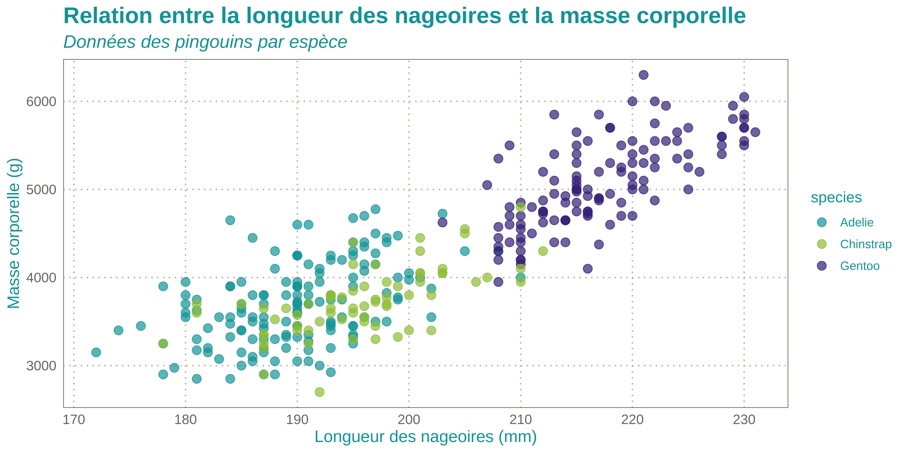

<!-- README.md is generated from README.Rmd. Please edit that file -->

# InraeThemes 

<!-- badges: start -->

[](https://lifecycle.r-lib.org/articles/stages.html#experimental)

[](https://www.gnu.org/licenses/gpl-3.0.en.html)
[](https://github.com/davidcarayon/InraeThemes/actions/workflows/R-CMD-check.yaml)
[](https://zenodo.org/badge/latestdoi/274901390)

<!-- badges: end -->

> *InraeThemes is an unofficial collection of R-related templates,
> themes, and other graphical elements based on formats related to R and
> in accordance with the INRAE design system.*

# Installation

The package can be installed using:

``` r
# install.packages("remotes")
remotes::install_github("davidcarayon/InraeThemes")
```

> Note: Older versions with Rmarkdown templates (i.e., 1.0.1) can still
> be downloaded using:
>
> ``` r
> # install.packages("remotes")
> remotes::install_github("davidcarayon/InraeThemes@v1.0.1")
> ```

You will also need the two fonts defined in INRAE’s design system:
Raleway and Avenir Next LT Pro. These fonts are available
[here](https://charte-identitaire.intranet.inrae.fr/content/download/3007/30036?version=5).

# Colors

A color palette is available in this package, based on INRAE’s design
system

``` r
palette_inrae()
```


## ggplot2 themes and scales

Customize your ggplots using INRAE’s colors with theme_inrae() and/or
scale\_<fill/color>\_inrae().

Here are examples using the iris dataset.

``` r
library(InraeThemes)
library(ggplot2)
data(iris)

ggplot(
  data = iris,
  aes(
    x = Sepal.Length,
    y = Petal.Length,
    group = Species
  )
) +
  geom_point(
    aes(
      color = Species,
      shape = Species
    ),
    size = 3,
    alpha = 0.8
  ) +
  geom_smooth(method = "lm", se = FALSE, aes(color = Species)) +
  scale_color_inrae() +
  labs(
    title = "Iris dimensions",
    subtitle = "This is a subtitle explaining what you can see in this plot",
    x = "Sepal Length",
    y = "Petal Length",
    color = "Iris species",
    shape = "Iris species"
  ) +
  theme_inrae()
```



``` r


ggplot(data = iris, aes(x = Sepal.Width)) +
  geom_histogram(aes(fill = Species),
    alpha = 0.5,
    position = "identity"
  ) +
  scale_fill_inrae() +
  labs(
    x = "Sepal Width",
    y = "Frequency",
    title = "Sepal Width distribution"
  ) +
  theme_inrae()
```


## Bootstrap theme

This package also provides a Sass theme built with {bslib}: bs_inrae().
Preview the theme with:

``` r
bslib::bs_theme_preview(bs_inrae())
```


And can be used in any Shiny app with :

``` r
ui <- fluidPage(
  theme = InraeThemes::bs_inrae(),
  ...
)
```

# Quarto templates

We developed templates following INRAE’s design system for the Quarto
scientific publishing system.

Source code, installation, requirements, and usage instructions can be
found in this repository:
[davidcarayon/quarto-inrae-extension](https://github.com/davidcarayon/quarto-inrae-extension).

# Project templates

This package provides two project templates that can be found either
through RStudio’s graphical interface
`Projects > New Project > New Directory` or using corresponding R
functions:

INRAE Book: A Quarto project of type “book”: `create_book()` Data
Analysis Project: An opinionated directory structure for data analysis:
`new_analysis()`
