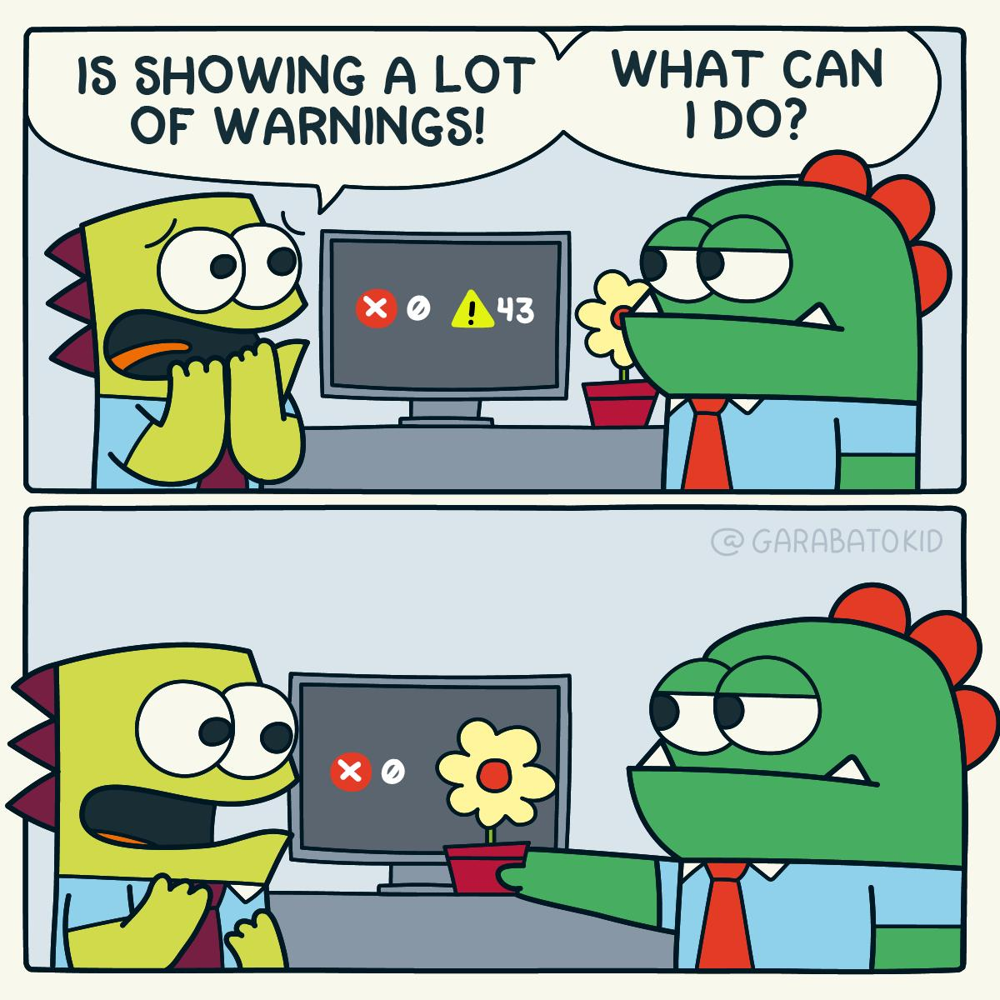

```{r setup, include=FALSE}
knitr::opts_chunk$set(
	echo = FALSE,
	message = FALSE,
	warning = FALSE,
	dpi = 300,
	out.width = "80%",
	dev.args=list(bg="transparent")
)
```

```{r packages}
library(InraeThemes)
library(dplyr)
library(ggplot2)
library(gt)
```

```{r}
# Si besoin des couleurs

# RGB
couleurs_inrae<-rgb(red=c(102,0,39,0,255,157,158,66,121,196),
                    green=c(193,140,86,0,255,197,214,48,120,192),
                    blue=c(191,86,98,0,255,68,227,137,112,179),
                    names=c("vert_inrae_clair","vert_inrae","vert_inrae_fonce","noir","blanc","vert","bleu_clair","bleu_fonce","gris_fonce","gris_clair"),
                    max= 255)

# HEX 
couleurs_hex <- c('#00a3a6', '#66c1bf','#008c8e','#275662','#000')
```


# Introduction {data-background=#E0FFFF}

## A propos de ce modèle

Ce modèle utilise le framework `revealJS` pour produire une présentation dynamique au format HTML.

Google Chrome est recommandé pour la lecture de cette présentation.

La présentation est construite en 2 niveaux : Les titres de premiers niveau définissent la dimension horizontale tandis que les titre de second niveau (et plus) définissent la dimension verticale. Chaque titre correspond à une diapositive.

Lors de la présentation, la touche `'f'` permet de passer en plein écran (i.e. *fullscreen*) et la touche `'o'` permet d'obtenir une vision globale de la présentation (i.e. *overview*). La barre espace permet de faire défiler les diapositives dans l'ordre chronologique.

## Diapositive à puce {data-background=#FFA07A}

Chaque diapositive peut être colorée individuellement en rajoutant une de ces balises à la suite du titre de la diapositive :

- Couleur CSS : {data-background=#ff0000}

- Image de fond : {data-background="image.jpeg"} (fonctionne avec les GIF)

- Vidéo de fond {data-background-video="video.mp4"}


Pour plus d'informations sur la personnalisation (transitions, animation des listes à puces, etc.) : [consulter le README du package revealjs](https://github.com/rstudio/revealjs)

# Démonstrations {data-background=styles/agriculture.jpg}

## Diapositive avec graphique

Ci-dessous un graphique avec un thème INRAE :

```{r plot, out.width = "60%", fig.align = "center"}
ggplot(mtcars, aes(x=wt, y=mpg)) +
  geom_point(aes(color = as.factor(gear)))+
  scale_color_inrae_n5()+
  geom_smooth(color = couleurs_inrae[1]) +
  labs(x = "Valeur de X", y = "Valeur de Y", title = "Titre du graphique", subtitle = "Sous-titre", color = "couleur") +
  theme_inrae() +
  theme(panel.background = element_rect(fill = "transparent", colour = NA),
        plot.background = element_rect(fill = "transparent", colour = NA))
```

> Ceci est un bloc de citation.


## Mise en page avancée

<div class="container">

<div class="col">
Une première image à gauche :

</div>

<div class="col">
Puis une autre image à droite :

</div>
</div>

## Diapositive avec un tableau

```{r gt}
iris %>% 
  head(10) %>% 
  gt() %>% 
  tab_header(title = "Exemple de tableau sur le jeu de données iris") %>%
  tab_options(table.width = pct(100))
```

## Avec affichage du code

```{r echo = TRUE, out.width = "80%", fig.align="center", fig.width = 10, fig.height = 4}

# On charge un package
library(ggplot2)

# On trace un graphique ggplot avec un second theme INRAE
ggplot(iris, aes(x = Species, y = Sepal.Length, fill = Species)) +
  geom_boxplot(color = "black") +
  geom_jitter(shape = 21, color = "black", alpha = 0.6)+
  labs(x = "Species", y = "Sepal Length") +
  theme_inrae_1()+
  theme(panel.background = element_rect(fill = "transparent", colour = NA),
        plot.background = element_rect(fill = "transparent", colour = NA))
```

# Merci de votre attention ! {data-background=#E0FFFF}
